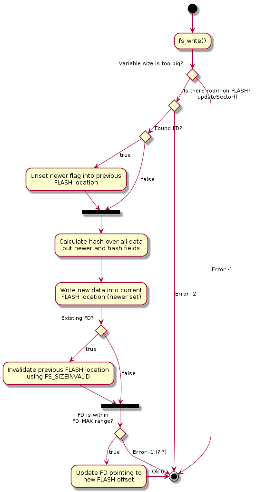

# wormvars

  Wormvars allows smart use of FLASH sectors to hold non-volatile variables on small microcontrolers systems.

  

  On boot time all FLASH sectors are accounted by fs_init() and an index is built. This allows fast access to variables only when information is actually needed saving RAM space.

  Basically what it does is to control a set of FLASH sectors allowing user to save variables setting its ID - a name composed of 16 bits and an extension composed of 3 bits. It is recommended to keep extension as zero as it meant to be used to extend default variable blocksize.
  
  When fs_write() is issued index is checked to update reference to new FLASH offset or to create a new entry. After new value is saved older one is marked as invalid so on reboot fs_init() knows which value is newer.
  
  fs_read() is a simple search on entry for existing indexed data, generating FLASH read requests accordingly.

  As times passes and new data is saved FLASH sectors become having less useful variables - which coined 'wormed' jargon that gives this project name meaning 'fragmented' sector. So the garbage-collector like fs_thread() comes into scene moving valid variables out of wormed FLASH sector and erasing it
  
  At the end it works as a circular buffer of FLASH sectors were variables are organized to occupy as few sector as possible and a minimum of blank sectors are always available. The search for a new wormed sector to relocate is therefore based on how many valid variables it contains.
  
  Threads are somewhat heavy for smaller systems. As of today this project uses Alan Dunkel's Protothreads (http://dunkels.com/adam/pt/) to circumvent this - in fact all we need is to keep relocation process going somehow in background. Code from protothreads v1.4 is just uncompressed on root dir under pt-1.4.
  
# A peek under the hood

  Currently each variable is stored on FLASH using a cell that is composed of a header plus data:

**wvars_structs.h**
  ``` c
  struct st_blockHeader{
      u8_t ver:2;    // header version (FS_VERSION(0))
      u8_t size:2;   // header size (FS_SIZEINVALID(0), FS_SIZE32(1))
      u8_t newer:1;  // newer flag (FS_BLOCK_CURRENT(0), FS_BLOCK_NEWER(1))
      u8_t ext:3;    // name extension
      u8_t hash;       // 8 bit hash of this cell
      u16_t name;      // name
  } __attribute__((packed));

  int fs_write(u16_t blockName, u8_t blockExt, const void *block_data, u8_t block_len);
  int fs_read(u16_t blockName, u8_t blockExt, void *block_data, u8_t block_len);
  ```
  
  

  When fs_write() is taken first tests are regarding cell size and FLASH availability.
  
  Assuming that already exists data on FLASH with this name/extension the very first thing then is to flag current data on FLASH as current meaning 'not newer'. Note that as newer flag is not considered on hash calculation this change will not invalidate hash for this block - this mechanism helps flagging data as obsolete while keeping it into non-volatile storage on all situations. Other trick here is use '0' to signalize FS_CURRENT as we always can write zeroes on previous used offsets;

  New data is then written on FLASH with newer flag set. If there were data on same name/extension flagged as current it is time to invalidate it. This invalidation is done again writing zeroes into Flash - this time on hash protected size field on header.

  If there are FDs available - it will be always the case if design were well done - FD is updated to point new offset on FLASH.
  

# How to use it on your system:

  Basically you will need to build and satisfy dependencies for main source under **wormvars** directory, see **ll_mock** directory to check what need to be implemented/wrapped into your system low level HAL functions.

  Your system as a whole doesn't need to use Protothreads. Just polling fs_thread() (fs_thread(0) to be precise) from your code main loop allowing it to do its relocations will suffice - refer to [MassiveWriteAndRead](https://github.com/joaomanojr/wormvars/blob/47dd4de3829362845266138f832232ac3b11cd98/test/WormvarsTest.cc#L97).
  
  fs_thread() uses flash_ready() implementation as semaphore-like barrier to FLASH device access, a minimum implementation is to use actual FLASH hardware busy status. Conflicts may arise after fs_thread() begin an operation over FLASH device, there are space for improvements there...

  Take a look into FLASH definitions at wormvars.c, it current runs on a 8 sectors with 4096 bytes. The minimum of 2 blank sectors is defined to avoid unnecessary relocation while giving some space for it to occur as some variables will need to be relocated to allow sector erases:

  **wormvars.c**
  ``` c
  #define FS_MIN_BLANKSECTORS 2

  #define FILESYSTEM_SECTOR_0 0x0F4000    /* correct values */
  #define FILESYSTEM_SECTOR_1 0x0F5000
  #define FILESYSTEM_SECTOR_2 0x0F6000
  #define FILESYSTEM_SECTOR_3 0x0F7000
  #define FILESYSTEM_SECTOR_4 0x0F8000
  #define FILESYSTEM_SECTOR_5 0x0F9000
  #define FILESYSTEM_SECTOR_6 0x0FA000
  #define FILESYSTEM_SECTOR_7 0x0FB000

  #define FILESYSTEM_SECTOR_SIZE 4096

  const u32_t Sector_base[]={
      FILESYSTEM_SECTOR_0,
      FILESYSTEM_SECTOR_1,
      FILESYSTEM_SECTOR_2,
      FILESYSTEM_SECTOR_3,
      FILESYSTEM_SECTOR_4,
      FILESYSTEM_SECTOR_5,
      FILESYSTEM_SECTOR_6,
      FILESYSTEM_SECTOR_7
  };
  ```

  Another important parameter is the maximum variables to be held on FLASH. More variables will imply in more RAM used and more FLASH sectors needed obviously:

  **wormvars_structs.h**
  ``` c
  #define FD_MAX 300
  ```


# Historical overview:

 This code is originally developed using 'dprintf oriented development' were originally built using WINARM (http://www.siwawi.arubi.uni-kl.de/avr_projects/arm_projects/#winarm , unfortunatelly a broken link nowadays) suite by Martin Thomas on Linux with GCC 4.11 - probably from Code Sourcery - on a baremetal system. 

 It were run on a ARM7 NXP LPC2368 controller and used to store general configuration data on FLASH regarding some user defined small string names and custom initialization parameters packed as structures. It replaces use of E2PROM with advantages of extended size and better scalability.

 After a while it is still reported to running realiably so I decided to share it with others and improve my code testing skills along.

# Further work:

- Improve documentation: add examples on defragmentation.
- Check wrote info reading again before invalidate former fd. (May be implemented on upper levels but still
  dangerous since it is up to RAM to keep info if write fails...). Better to create a wrapper to check newer info prior
  to make older invalid.
- Download protothreads via cmake as done with gtest.
- Parameterize wormvars more on FLASH sectors amount, size and addresses.
- Provide better integration on new targets.
- Create an example application showing how to use wormvars.
- Give up after a while (time TBD) on writing flash sectors.
- Multi-block variable support.
